# GardenMapBot (GaMBo🌸)

## À propos du projet


        **GaMBo🌸** est un robot conçu pour cartographier les jardins en mesurant la température, l'humidité et l'ensoleillement. Ces données lui permettent de fournir des conseils pour optimiser la croissance et la santé des plantes.

<br clear="left"/>

## Sommaire

[I. Qui sommes-nous ?](#i-qui-sommes-nous-)

[II. Pourquoi ce projet ?](#ii-pourquoi-ce-projet-)

[III. Fonctionnalités](#iii-fonctionnalités)

[IV. Liste du matériel du projet final](#iv-liste-du-matériel-du-projet-final)

[V. Installation du projet final](#v-installation-du-projet-final)

[VI. Notre parcours](#vi-notre-parcours)

[VII. Licence](#vii-licence)

[VIII. Contacts](#viii-contacts)

[IX. Contributions](#ix-contributions)

[X. Remerciements](#x-remerciements)

## I. Qui sommes-nous ?

Nous sommes un groupe de 4 étudiants passionnés, inscrits en classe préparatoire au cycle ingénieur à ESEO - Cours Lumière, située au Togo. L'équipe est constituée de GNASSINGBE Émilie, DOUMBIA Aïchata, KORDOHOU Errath et LEENAERTS Loïc (chef de projet). 

## II. Pourquoi ce projet ?

Inspirée par l'événement mondial Arduino Day, notre équipe a saisi l'opportunité offerte par nos enseignants de concevoir des projets de robotique. Nous aspirons à améliorer la culture des plantes et à encourager l'utilisation de la tech pour faciliter et optimiser l'agriculture sur notre continent.

## III. Fonctionnalités

- **Prise en charge de formes de jardins quelconques**
- **Cartographie thermique**
- **Cartographie de l'humidité**
- **Cartographie de l'ensoleillement**
- **Conseils de jardinage**

```mermaid
graph TD;
    A[Capteurs de température, humidité et luminosité] --> B(Analyse des données);
    B --> C{Conditions de jardinage};
    C -->|Température élevée| D(Arrosage plus fréquent);
    C -->|Humidité basse| E(Augmenter l'arrosage ou ajouter du paillis);
    C -->|Ensoleillement insuffisant| F(Déplacer les plantes vers des zones plus ensoleillées ou ajouter des lampes de croissance);
    C -->|Conditions optimales| G(Aucun conseil nécessaire);
    D --> H{Connecté à un ordinateur};
    E --> H;
    F --> H;
    G --> H;
    H --> I(Interface utilisateur);
    I --> J[Tableau de données];
    I --> K[Graphiques de tendances];
```



## IV. Liste du matériel du projet final

| **Système**             | **Arduino**                            | **Espressif**                                                    |
|-------------------------|----------------------------------------|------------------------------------------------------------------|
| 🖥️ **Microcontrôleur** | Arduino NANO                           | ESP-32-CAM                                                       |
| 📡 **Capteurs**         | - 🌡️💧DHT22 × 1                       | - 🌡️💧DHT22 × 1                                                 |
|                         | - 🌅 Photorésistance × 1               | - 🌅 Photorésistance × 1                                         |
|                         | - 🔊 Capteur ultrason × 3              | - 🔊 Capteur ultrason × 3                                        |
|                         | - 📷 Module caméra                     |                                                                  |
|                         | - 🌍 Module GPS                        | - 🌍 Module GPS                                                  |
| 🛠️ **Autres**          | - ⚙️ Servomoteurs débridés × 4~6       | - ⚙️ Servomoteurs débridés × 4~6 (dépendant de la charge totale) |
|                         | - 🔋 Batterie : rechargeable et légère | - 🔋 Batterie : rechargeable et légère                           |
|                         | - 🛡️ Châssis : PLA                    | - 🛡️ Châssis : PLA                                              |

## V. Installation du projet final
😶‍🌫️

## VI. Notre parcours

Le projet final implique un robot entièrement autonome, capable de cartographier un jardin de forme complexe. Mais avant d'atteindre ce résultat final, nous devons adopter une méthode itérative. Ainsi, dans un premier temps, le projet se limitera à ces fonctionnalités :

- **Prise en charge de formes de jardins rectangulaires**
- **Cartographie thermique**
- **Cartographie de l'humidité**
- **Cartographie de l'ensoleillement**

Nous avons eu à réaliser le schéma que voici pour avoir une idée de la forme du robot et de l'emplacement des capteurs et composants pour optimiser l'espace efficacement afin d'accueillir l'ensemble du câblage. 


- Nous avons donc placé le [🌡️💧DHT22](https://grabcad.com/library/dht22-module-1) tourné vers le sol et sur la face inférieure du robot pour pouvoir prendre nos mesures le plus près possible du sol. 
- Les 4 [⚙️Servomoteur](https://grabcad.com/library/servo-motor-sg90-6) et les 3 [🔊Capteur ultrason](https://grabcad.com/library/ultrasonic-sensor-hc-sr04-3) ont eux, étés logés sur les côtés symétriquement par rapport à l'axe passant par le milieu des faces inférieur et supérieur. 
- La [🌅 Photorésistance](https://grabcad.com/library/gl5528-photoresistor-1) est quant à elle placée de sorte que le milieu de sa face supérieur soit confondus avec l'axe de symétrie. 
- L'antenne du [🌍 Module GPS](https://grabcad.com/library/ublox-m6-with-ceramic-antenna-1) a été placée au-dessus de l'[🖥️Arduino NANO](https://grabcad.com/library/arduino-nano--1) pour des raisons d'esthétiques. 
- La carte [🖥️Arduino NANO](https://grabcad.com/library/arduino-nano--1) est elle-même placée de telle sorte que ces ports soient exposés et facilement accéssibles de l'extérieur.

<br clear="right"/>
<br>
Voici les étapes de la modélisation du corps de notre robot :
<br>
 <video autoplay loop playsinline src="https://github.com/THE07s/GardenMapBot/assets/101391118/6161aa29-c9dc-4e73-8f62-6bf7b1b91bbf">  video </video>
<br>

Voici les différentes parties qui forment le boitier de notre robot :
<br>
<p>
    
    
</p>

Après la modélisation, nous avons procédé à l'impression du corps et en raison d'un certain nombre de problèmes d'encadrement, nous avons dû procéder au limage de certaines bordures pour permettre l'accueil des capteurs.

Nous avons ensuite débridé les servomoteurs pour permettre leur rotation en continu. Pour des raisons de logiques, nous avons choisi de prendre un angle de 90° comme position d'arrêt. Voici le code de test que nous avons écrit :

```cpp
#include <Servo.h>

Servo avant_gauche, arriere_gauche, avant_droit, arriere_droit;

void setup() {
  avant_gauche.attach(2);
  arriere_gauche.attach(3);
  avant_droit.attach(4);
  arriere_droit.attach(5);
}

void loop() {
  avant_gauche.write(90);
  arriere_gauche.write(90);
  avant_droit.write(90);
  arriere_droit.write(90);
}
```

À présent, nous allons procéder à une programmation fonctionnelle en lieu et place d'une programmation orientée objet en raison du manque de temps et d'entraînement en C++.

J'ai donc commencé à créer les fonctions de base du robot, autrement dit avancer, reculer et tourner. Pour la fonction *tourner()* il me fallait trouver le nombre de millisecondes au bout duquel le robot faisait une rotation sensiblement égale à 90°. Voici donc le programme de test qui traduit mes déductions :

```cpp
#include <Servo.h>

Servo avant_gauche, arriere_gauche, avant_droit, arriere_droit;

void stop() {
  avant_gauche.write(90);
  arriere_gauche.write(90);
  avant_droit.write(90);
  arriere_droit.write(91);
}

void avancer(int duree) {
  avant_gauche.write(180);
  arriere_gauche.write(96);
  avant_droit.write(0);
  arriere_droit.write(0);
  delay(duree);
  stop();
}

void reculer(int duree) {
  avant_gauche.write(0);
  arriere_gauche.write(0);
  avant_droit.write(180);
  arriere_droit.write(180);
  delay(duree);
  stop();
}

void tourner_moins_90() {
  avant_gauche.write(0);
  arriere_gauche.write(0);
  avant_droit.write(0);
  arriere_droit.write(0);
  delay(650);
  stop();
};

void tourner_plus_90() {
  avant_gauche.write(180);
  arriere_gauche.write(180);
  avant_droit.write(180);
  arriere_droit.write(180);
  delay(650);
  stop();
};

void carre() {
  for (int i = 0; i < 4; i++) {
    avancer(1750);
    tourner_plus_90();
  };
};

void setup() {
  avant_gauche.attach(2);
  arriere_gauche.attach(3);
  avant_droit.attach(4);
  arriere_droit.attach(5);
}

void loop() {
  carre();
}
```
> [!NOTE]
> ### Problèmes & Solutions
> Lors de la réalisation de ce projet, nous avons eu à faire face à une flopée de problèmes à savoir :
> **Pendant la modélisation 3D** :
> - Centrer les extrusions (destinées à la carte) horizontalement au milieu de la face réservée en utilisant la modélisation paramétrique.
> - Établir une connexion claire entre les esquisses et la modélisation 3D.
> - Éviter les sur-contraintes de l’esquisse.

> [!WARNING]
> **Après la modélisation 3D** :
> - Le DHT22 et le module GPS ne rentraient pas dans l'espace qui leur était réservés.
> - Les Servomoteurs flottaient dans l'espace qui leur était réservés.

> [!NOTE]
> **Pendant la conception du circuit** :
> - Importer le DHT22 dans Fritzing.
> - Importer le Shield adapté à l'Arduino NANO dans Fritzing.
> - L'absence du NANO, du module GPS et du DHT22 dans Tinkercad.

> [!TIP]
> Pour résoudre ces problèmes, nous avons "innover" et fait les tests nécessaires avec l'Arduino UNO étant donné les nombreuses similitudes entre cette carte et l'arduino NANO. Quant aux pièces, nous avons limé les contours pour pouvoir placer le DHT22 et utiliser le pistolet à colle pour fixer les servomoteurs.

### Références

- https://www.youtube.com/watch?v=E0NVC8xhf3I ⇨ conception du boitier
- https://cults3d.com/fr/mod%C3%A8le-3d/art/wheel-for-sg90-servo ⇨ roues associées au Servomoteur
- https://arduino-france.site/ultrason-hc-sr04/ --> programmation de l'Ultrason
- https://github.com/miyujach/Projet-Robot/blob/9f384fafb67974cea4fc9b659ff7004661033b75/README.md#projet-ascyloom ⇨ rédaction de la documentation

## VII. Licence

Distribué sous la Licence Apache-2.0. Voir `LICENSE` pour plus d'informations.

## VIII. Contacts

-  LEENAERTS Loïc Harry - 📠+228 79 62 67 84 <br clear="right"/>
<br>

-  GNASSINGBE Emilie Koboyo - 📠+228 93 26 69 57 <br clear="right"/>
<br>

-  DOUMBIA Aïchata  - 📠+228 70 90 99 77 <br clear="right"/>
<br>

-  KORDOHOU Errath - 📠+228 91 02 15 05 <br clear="right"/>
<br>

Lien du projet : [GitHub - GaMBo 🌸](https://github.com/THE07s/GarderMapBot.git)

## IX. Contributions

- M. Sylvestre OLANLO (Disposition des matériels dans le boitier)

- M. Josaphat BANKAÏ (Fusion 360)

- Kenneth K. NONVIGNON (Diagramme)

- Pierre K. ATADEGNON & Adama NADJOMBE (Servomoteurs débridés)


## X. Remerciements

- M. Sylvestre OLANLO, qui nous a suivi depuis le tout début.

- M. Giovanni KAMEKPO, qui nous a initié à Git & GitHub.

- M. Josaphat BANKAÏ, qui nous entretenu sur la modélisation paramétrique.
